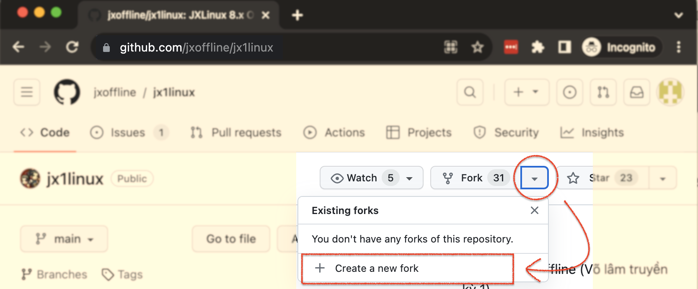
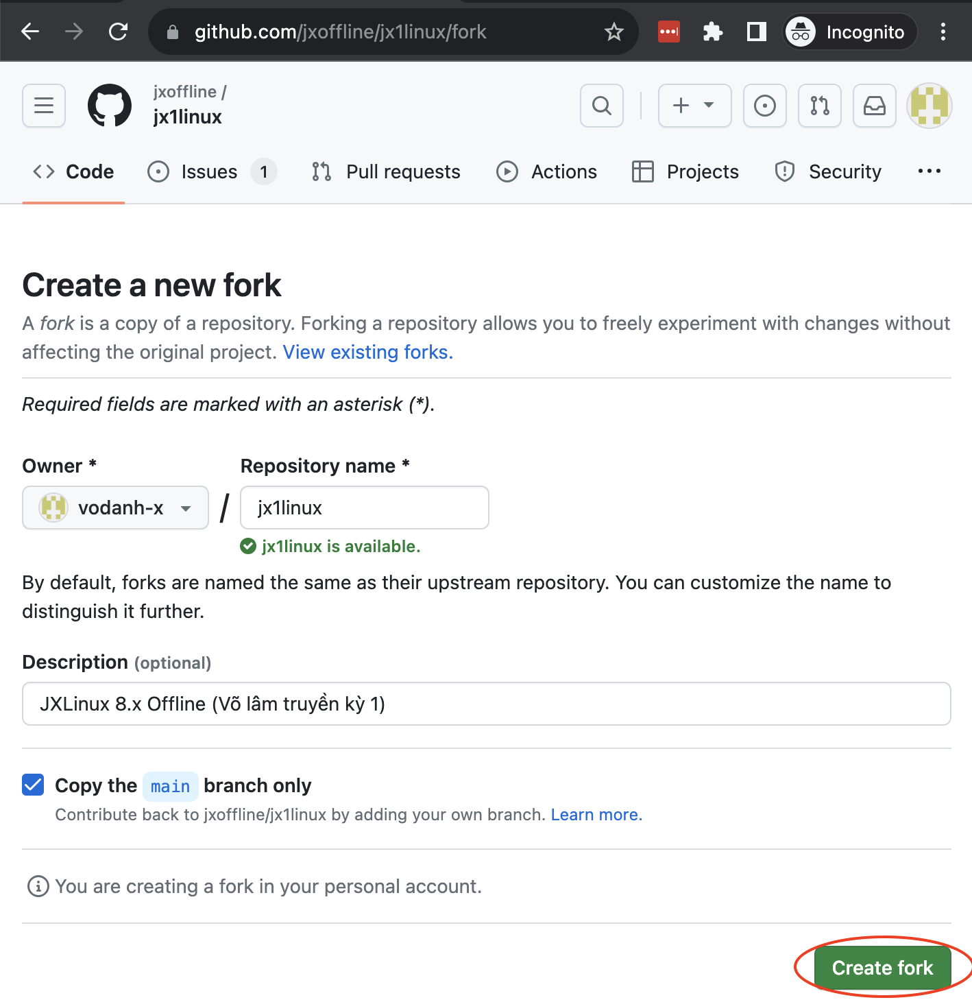
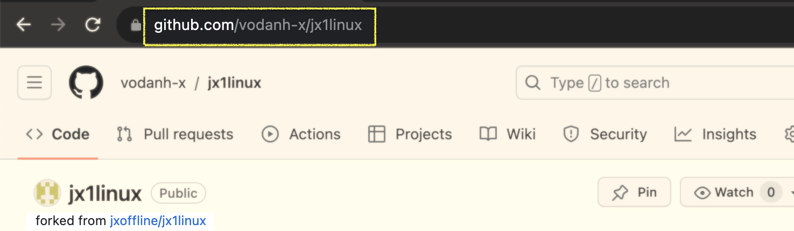
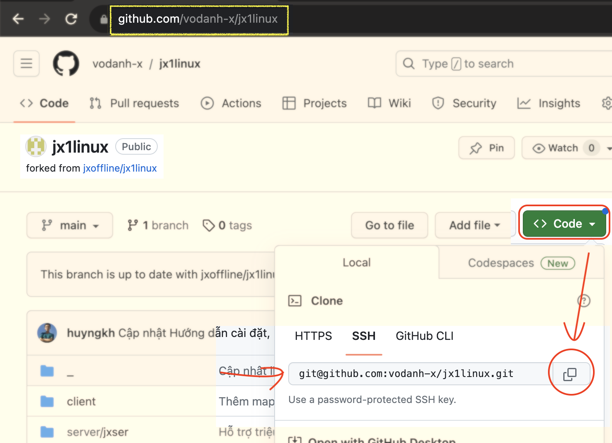
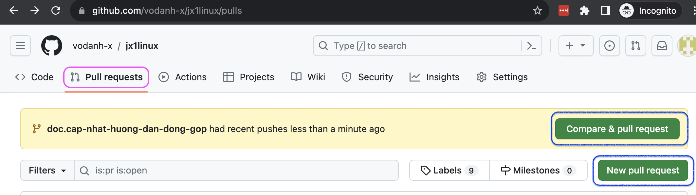
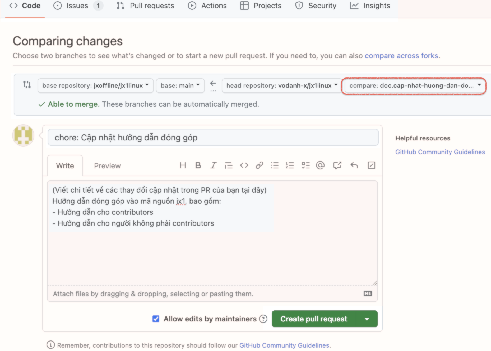

<p align="center">
	<a href="https://fb.com/groups/volamquan">
		
	</a>
</p>
<p  align="center">Tham gia thảo luận tại <a href="https://fb.com/groups/volamquan">https://fb.com/groups/volamquan</a></p>
<p align="center">
	<a href="https://fb.com/groups/volamquan">
		
	</a>
	<a href="https://github.com/jxoffline/jx1linux/releases">
 		
	</a>
	<a href="https://img.shields.io/badge/platform-win32,win64-cyan">
 		
	</a>
	<a href="https://img.shields.io/badge/license-GNU-yellow">
 		
	</a>
</p>

[🏡 Trở về trang chính](https://github.com/jxoffline/jx1linux/blob/main/README.md) > Hướng dẫn đóng góp


## 2. ✨Hướng dẫn đóng góp

### 2.1 Tạo bản sao đề án với Fork

Thao tác này bạn chỉ thực hiện một lần duy nhất khi bắt đầu đóng góp.

**Bước 1**: Truy cập trang Github của Hội quán https://github.com/jxoffline/jx1linux


**Bước 2**: Thực hiện fork toàn bộ đề án

Tại trang chính của **jx1linux**, bấm vào mũi tên sổ xuống bên cạnh mục Fork và chọn mục **Create a new fork** như ảnh bên dưới




**Bước 3**: Ở màn hình tiếp theo, bấm **Create fork**.




**Bước 4**:  Chờ một chút đến khi quá trình sao chép hoàn tất. Bạn sẽ được chuyển đến trang Github bản sao dưới tên tài khoản của mình có dạng  https://github.com/[tai-khoan-git-của-ban]/jx1linux.




### 2.2 Tạo nhánh trên bản sao fork

- **Bước 1**: Tải đề án về máy qua git clone
**Windows**
```bash
cd d:\jx
git clone <địa-chỉ-fork-git>
```
**Mac/Unix**
```bash
cd ~/jx
git clone <địa-chỉ-fork-git>
```

Trong đó, `địa-chỉ-fork-git` được lấy từ trang Github bản sao của bạn. Tuỳ theo giao thức kết nối git bạn sử dụng là HTTPS, SSH hay Github client mà sao chép địa chỉ tương ứng. Ví dụ, trong hình dưới mình chọn kết nối bằng SSH, nên mình sẽ thực hiện tải về máy như sau:
```bash
git clone git@github.com:vodanh-x/jx1linux.git
```



Sau khi hoàn tất, bạn sẽ tìm thấy một thư mục mới tên **jx1linux** xuất hiện trong thư mục **jx** của mình. Gõ lệnh sau để truy cập thư mục:
```bash
cd jx1linux
```


- **Bước 2**: Tạo nhánh trên máy tính cá nhân với lệnh:

```
git checkout -b <tên-nhánh>
```

Xem cách đặt tên nhánh ở [Mục 2.1](https://github.com/jxoffline/jx1linux/blob/main/README.md#21-quy-%C6%B0%E1%BB%9Bc-%C4%91%E1%BA%B7t-t%C3%AAn-nh%C3%A1nh). Ví dụ: tên nhánh là `doc.cap-nhat-huong-dan-dong-gop`, gõ:
```bash
git checkout -b doc.cap-nhat-huong-dan-dong-gop
```


- **Bước 3**: Chỉnh sửa, viết script thoải mái trên máy cá nhân.


- **Bước 4**: Commit và push toàn bộ nội dung chỉnh sửa lên git server (đưa lên nhánh vừa tạo ở bước 1)

  ```
   git add .
   git commit -m "ghi chú commit"
   git push --set-upstream origin <tên-nhánh>
  ```
Commit cần phản ánh nội dung các tập tin đã chỉnh sửa. Ví dụ: `git commit -m "chore: Cập nhật hướng dẫn đóng góp"`


- **Bước 5**: Từ giao diện web Github, mở tab Pull Request (kế tab Code) như hình


Trong màn hình hiện ra, ở góc phải sẽ có nút **Compare & pull request** màu xanh lá bên góc phải như hình. Bấm vào nút này để bắt đầu tạo Pull Request.


Nút **Compare & pull request** sẽ tự động điền cho bạn nhánh làm việc như phần khoanh đỏ trên hình. Nếu bạn bấm **New Pull Request**, bạn sẽ phải tự điền nhánh này một cách thủ công.

Bên dưới ghi chú vào tóm tắt nội dung các thay đổi và bấm **Create pull request** để hoàn tất.


- **Bước 6**: Nếu có thêm thay đổi chỉnh sửa gì trên nhánh/PR này. Mọi thao tác sẽ thực hiện trên nhánh đấy trong máy cá nhân theo hướng dẫn ở **Bước 4**. Các thay đổi này sẽ tự động cập nhật trên Pull request mà bạn không cần phải làm gì thêm.

