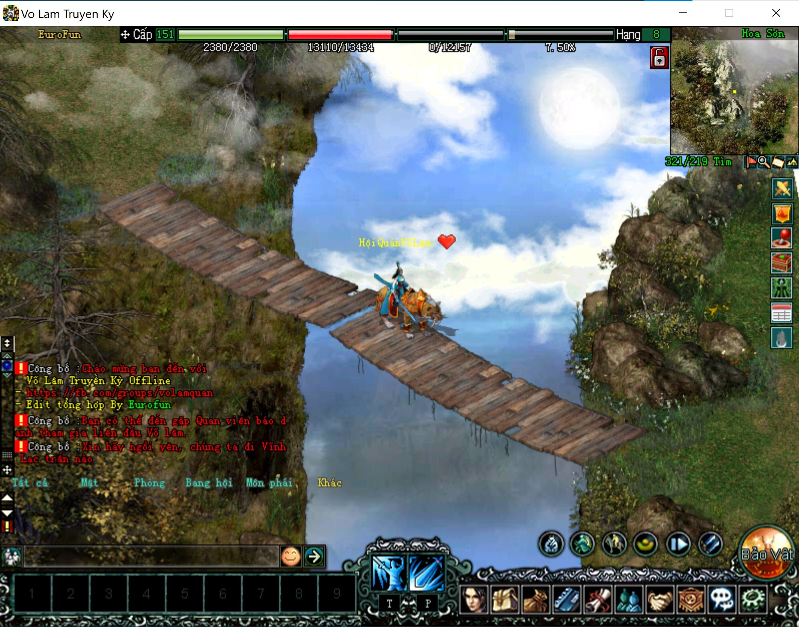
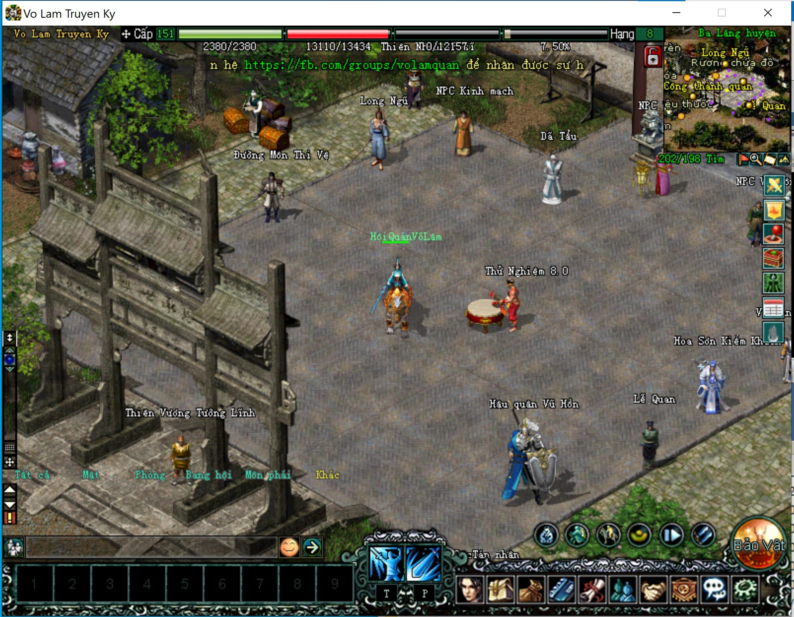
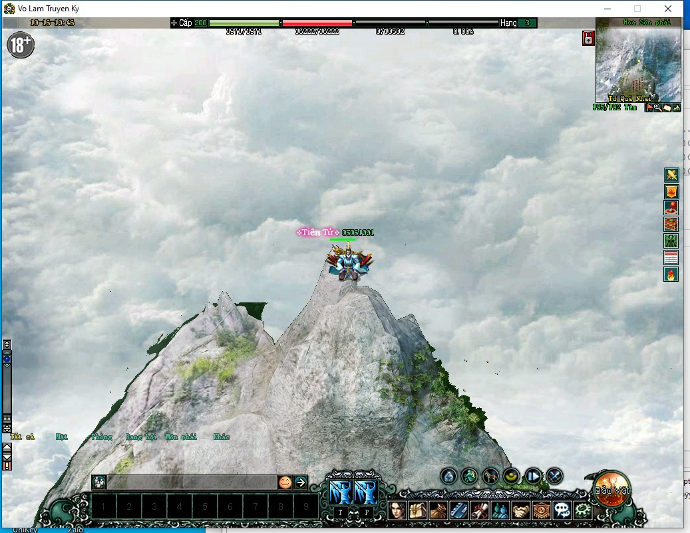
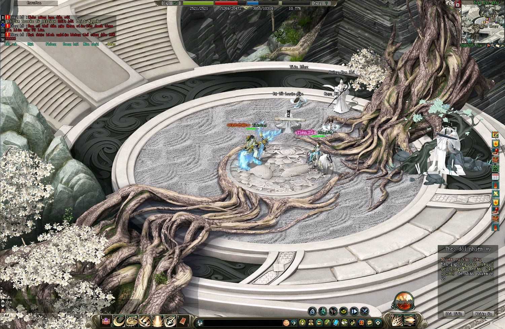
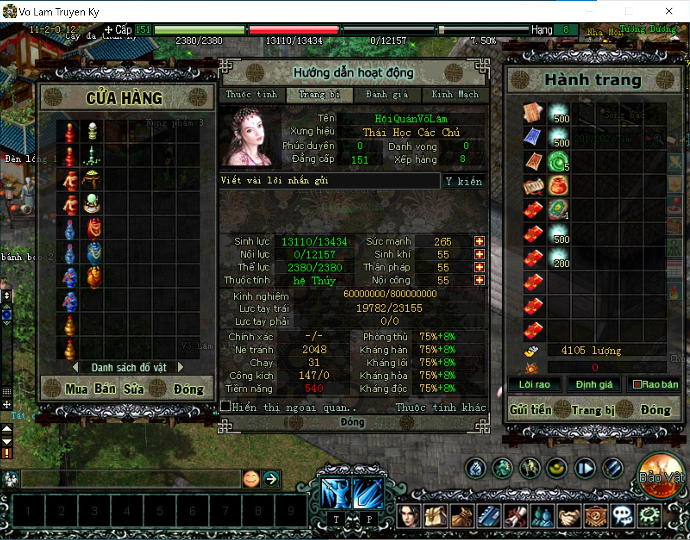
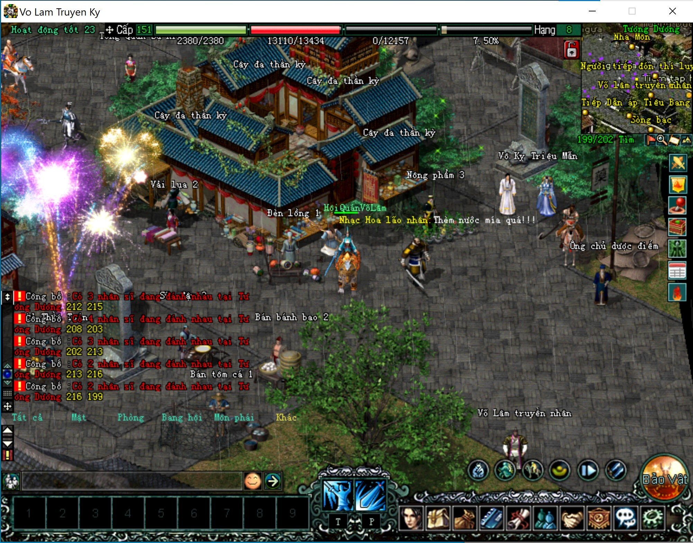

	

Tham gia thảo luận tại <a href="https://fb.com/groups/volamquan">https://fb.com/groups/volamquan</a>

	
	
	
	

# Võ lâm Offline

JXLinux 8.x Offline (Võ lâm 1)

Các mã nguồn scripts được chỉnh sửa và phát triển bởi nhóm Eurofun phân phối lại theo giấy phép GNU GPL.

## 1. 🚀 Thông tin cơ bản

Tên mã: **JxOffline 1**

Tiếng Trung: **剑侠情缘**

Tiếng Việt: **VLTK 1 - JXLinux Offline**

Phiên bản: **8.x**

#### Cấu trúc thư mục

- **client**: Thư mục chứa mã nguồn scripts và các tập tin cần thiết chạy game client.
- **server**
  - **jxser**: Thư mục chứa scripts và các tập tin cần thiết chạy game server trên nền **Centos**.
- **requirements.txt**: yêu cầu cấu hình tối thiểu cho phần cứng cũng như phần mềm để vận hành hệ thống game.
- **revision.log**: ghi chú các thay đổi qua từng phiên bản.

## 2. ✨Hướng dẫn đóng góp

### 2.1 Quy ước đặt tên nhánh

Khi đặt tên nhánh cần tuân theo quy ước như sau:

- Tên nhánh và tên PR được viết thường không dấu, cách nhau bởi dấu chấm (.) và có tiếp đầu ngữ. Ví dụ: **script.them-kim-ma-lenh-khi-danh quai-9x**. Trong đó:
  - **script**: là tiếp đầu ngữ
  - **them-kim-ma-lenh**: là tên ngắn gọn của nhánh hoặc PR phản ánh được nội dung của phần chỉnh sửa, trong ví dụ này là `thêm kim mã lệnnh khi đánh quái 9x`.

- Tiếp đầu ngữ được quy ước cụ thể như sau:
  - **doc**: chỉnh sửa bao gồm các ghi chú, tài liệu hướng dẫn.
  - **bin**: chỉnh sửa bao gồm các công cụ hỗ trợ, các tập tin nhị phân trong client, server.
  - **script**: chỉnh sửa bao gồm các tập tin scripts và tập tin cấu hình ini, txt.
  - **feat**: (viết tắt của feature) dùng khi bạn muốn đăng lên một tính năng lớn, trong nhánh gồm nhiều thay đổi về `script`, có khi kèm cả các tài liệu `doc` và file nhị phân `bin`.

### 2.2 [Các bước thực hiện](./CONTRIBUTING.md)

Xem chi tiết tại [ĐÂY](./CONTRIBUTING.md)

## 3. 🕹Hướng dẫn cài đặt

#### 👉 Các bước cài đặt

- **Bước 1**: Cài đặt trò chơi phiên bản gốc, sau đó mở sẵn thư mục cài đặt lên chuẩn bị cho [Bước 4](#) ( bằng cách click phải chuột lên biểu tượng trò chơi vừa cài đặt xong, chọn `Open file location`). Lưu ý hai thư mục bên dưới đây:

  - **data**
  - **music**

- **Bước 2**: Tải máy chủ ảo VMWare **WinXP** và **CentOS** `server.7z`.

  Chọn một trong các nhà cung cấp dịch vụ lưu trữ bên dưới

  - **Mediafire**: [Tải về](https://www.mediafire.com/file/3i9biis3j27urzq/server.7z/file)
  - **Mega**: [Tải về](https://mega.nz/file/BJZHjQLC#XRYZVoqiCLfNqP-eLmzeZpWClAdY0Cp7WbzA2fo4zZ4)

- **Bước 3**: Tải client và server mới nhất từ Github.
  
  GitHub sẽ nén cả client và server mới nhất nhất vào tập tin `jx1linux-main.tar.gz`. Để tải tập tin này bấm vào link dưới đây
  
  https://github.com/jxoffline/jx1linux/archive/refs/heads/main.tar.gz
  
- **Bước 4**: Cài đặt

  - Giải nén `jx1linux-main.tar.gz` vào nơi bạn muốn lưu trữ hệ thống game. Giả sử bạn lưu ở ổ `D:\`. Sau khi giải nén bạn sẽ có 2 thư mục `D:\client` và `D:\server`.
  - Giải nén các máy chủ ảo `server.7z` vào thư mục server (`D:\server\`). Nếu giải nén thành công, bạn sẽ có thêm 2 thư mục `Win` và `CentOS` bên trong thư mục `server`.
  - Dữ liệu gốc gồm 2 phần là `data` và `music`:
    - **data**: Copy thư mục `data` ở **Bước 1** dán đè lên thư mục `data` có sẵn bên trong thư mục `client` (`D:\client`).
    - **music**: Copy thư mục `music` ở **Bước 1** chép đè vào thư mục music có sẵn trong `client` (`D:\client`).

- **Bước 5**: Triển khai

  - Vận hành máy chủ

    Mở thư mục `D:\server` chạy lần lượt các máy ảo

    - `server\CentOS\CentOS16-EuroFun.vmx`
    - `server\Win\JXWindows-EuroFun.vmx`

    Nhớ chọn `I moved it` ở lần đầu chạy máy ảo.

  - Cập nhật jxser

    Sử dụng WinSCP kết nối vào máy chủ CentOS, sau đó chép toàn bộ thư mục `jxser` lên máy chủ này.

  - Sau khi cả 2 máo ảo đều khởi động xong, cần khởi động các dịch vụ trên máy chủ CentOS.

    - Bấm lần lượt Bước 1, Bước 2 và Bước 3 nằm trên màn hình Desktop máy ảo `JXWindows-EuroFun`.

    - Ở `Bước 3`, trên ứng dụng `SecureCRT`, bấm Kết nối.
      
      Chờ đến khi dấu nhắc lệnh xuất hiện trên màn hình đen của ứng dụng SecureCRT.
      
      Trên thanh truy xuất nhanh `SecureCRT`, bạn sẽ tìm thấy các nút shortcut `1`, `2`, `3`, `S1` và `Nâng cấp` (các nút tròn xanh lá). Do bạn vừa chép `jxser` lên máu chủ CentOS, cần bấm shortcut **Nâng cấp** ở góc phải cùng để thực hiện ghi nhận cập nhật thư mục script mới. Những lần khởi động sau không cần phải bấm nút này nữa. 
      
      Cuối cùng, bấm lần lượt các shortcut 1, 2, 3 và S1 trên các tab khác nhau của  `SecureCRT` để khởi động máy chủ.
      
      Hoàn tất.
      

**YouTube**: https://youtu.be/xrgB5tpAHNQ?si=XptYZwgmkFXR-q-1

**FAQ** (câu hỏi thường gặp): https://fb.com/groups/volamquan/posts/997527467623112/

#### 👉 Vài hình ảnh trong game

Hoa Sơn tuyệt đỉnh

Ba Lăng huyện

Hoa Sơn phái tu tiên

Tiêu Dao (có thể tự mod thêm vào)

Hiệu thuốc Tương Dương

Kỳ nhân dị sĩ tụ tập tại Tương Dương phủ

## 4. ☣Công cụ hỗ trợ phát triển

#### 4.1 JXStudio 20212

Công cụ đa dụng hỗ trợ biên tập Lua scripts hiển thị tiếng Việt TCVN3,  chỉnh sửa nhanh tài khoản, v.v...

**Mega**: [Tải về](https://mega.nz/file/8VZhWZ6K#COZqGMq5ayWQX-9JtB5VTR94wS6V-gcJn8z0BclmqC4)

**Mediafire**: [Tải về](https://www.mediafire.com/file/yfhlwn0wkhkgkzt/JxStudio_2012.7z/file)

#### 4.2 JXLuaEditor 1.0

Công cụ hỗ trợ biên tập Lua scripts hiển thị tiếng Việt TCVN3, không phá vỡ cấu trúc chữ gốc tiếng Trung. Đồng thời hỗ trợ chuyển ngữ nhanh với tổ hợp phím Ctrl + Shift + T.

**Mega**: [Tải về](https://mega.nz/file/4RJEVIzY#LtY9XKpUJwOm7-sVmU1qtLZmT1VTmtw--hmP5-NyrlY)

**Mediafire**: [Tải về](https://www.mediafire.com/file/6u0x9mlkk0vz9j1/JxLuaEditor-v1.0.7z/file)

#### 4.3 WinSCP

Công cụ chép scripts, và các tập tin khác lên game server. 

**Mega**: [Tải về](https://mega.nz/file/II5wFZYT#6XCyrcJHlRrSHQKQQ_dG12sIef6-0rA9fySFMXpsRZU)

**Mediafire**: [Tải về](https://www.mediafire.com/file/kbyox8j2hfq2p5r/WinSCP.7z/file)

